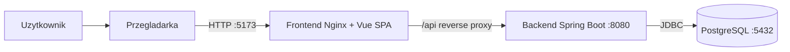
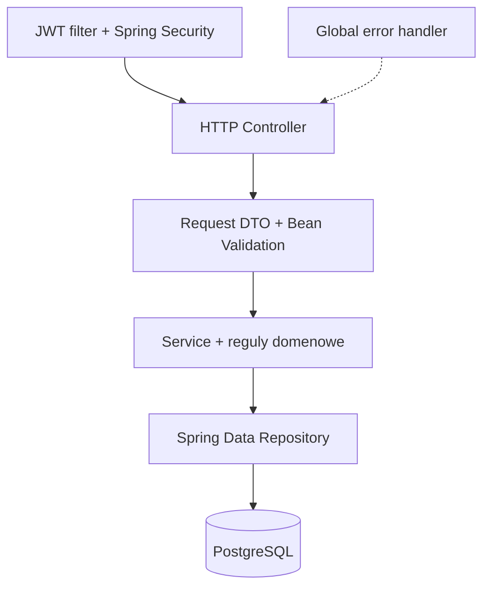
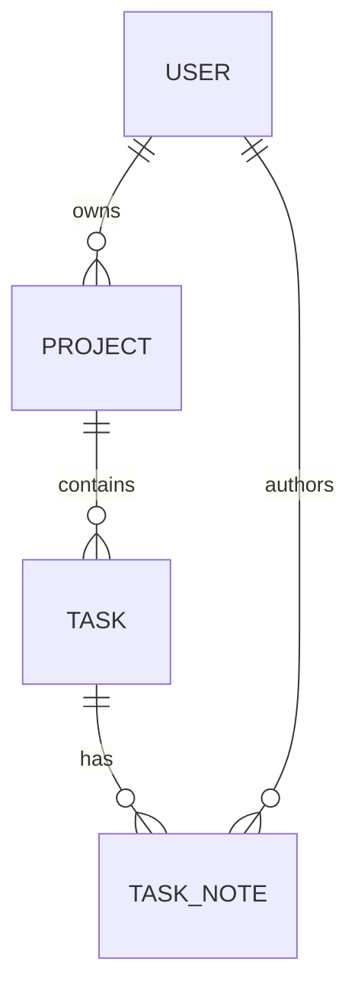

# TaskFlow - Architecture Decision Record

Wersja: 1.0  
Status: Accepted  
Ostatnia aktualizacja: 2026-06-27  
Zakres: architektura zaimplementowanego systemu

## 1. Cel dokumentu

Ten dokument rejestruje decyzje architektoniczne obowiazujace w TaskFlow. Opisuje kontekst, rozpatrzone alternatywy, uzasadnienie, konsekwencje oraz realizacje kazdej decyzji w repozytorium.

Decyzje maja status `Accepted`, chyba ze wskazano inaczej. Zmiana decyzji wymaga dodania nowego wpisu, ktory zastepuje poprzedni, zamiast usuwania historii.

### 1.1. Jak powstawal ADR

Pierwsza wersja ADR powstala przed implementacja. Decyzje byly nastepnie weryfikowane podczas budowy kolejnych pionowych przekrojow aplikacji.

| Wersja | Wynik |
| --- | --- |
| Roboczy szkic | Wybor glownego stosu i modularnego monolitu; zaproszenia pozostawione jako kandydat do zakresu |
| Implementacja | Potwierdzenie granic modulow, owner-scoped access, use-case API i strategii testow |
| 1.0 | Utrwalenie modelu single-owner oraz uzgodnienie ADR z kodem, schematem, API i infrastruktura |

Najwazniejsza zmiana zakresu jest opisana w ADR-001. Pozostale decyzje zostaly potwierdzone podczas implementacji i maja wskazany slad w repozytorium.

### 1.2. Czynniki decyzyjne

Decyzje porownywano wedlug tych samych kryteriow:

1. zgodnosc z wymaganiami funkcjonalnymi i niefunkcjonalnymi,
2. adekwatnosc do wielkosci systemu i zespolu,
3. utrzymanie regul bezpieczenstwa i domeny w backendzie,
4. mozliwosc automatycznego testowania najwiekszych ryzyk,
5. powtarzalne uruchomienie calego systemu,
6. stosunek wartosci funkcji lub technologii do kosztu wdrozenia i utrzymania.

Alternatywy odrzucone w tym dokumencie nie sa ogolnie gorsze. Nie rozwiazywaly problemow wystepujacych w TaskFlow na tyle dobrze, aby uzasadnic ich koszt w aktualnym zakresie.

## 2. Architektura finalna

### 2.1. Widok kontenerow

Frontend jest budowany przez Vite i serwowany jako pliki statyczne przez Nginx. Nginx przekazuje zadania `/api` do backendu, dzieki czemu przegladarka korzysta z jednego originu. W trybie developerskim Vite przekazuje `/api` do lokalnego backendu.

### 2.2. Warstwy backendu

Backend jest modularnym monolitem. Pakiety `auth`, `project`, `task`, `note`, `dashboard` i `report` odpowiadaja przypadkom uzycia, a `security`, `common` i `config` zawieraja infrastrukture wspolna.

### 2.3. Model danych

Encje `User`, `Project`, `Task` i `TaskNote` tworza cztery powiazane zasoby. Dostep do projektu i zasobow podrzednych wynika z relacji `Project.owner`.

## 3. Rejestr decyzji

## ADR-001: Zakres produktu jako owner-scoped kanban

**Status:** Accepted, zastepuje zalozenie o zaproszeniach z roboczego szkicu.

**Decyzja:** Finalna wersja TaskFlow jest lekka aplikacja kanban, w ktorej projekt ma jednego wlasciciela. Wlasciciel zarzadza projektem, zadaniami i notatkami. `ProjectMember` i `ProjectInvite` nie sa czescia finalnego zakresu.

**Kontekst:** Podstawowym przypadkiem uzycia jest organizacja wlasnych projektow i zadan. Roboczy zakres uwzglednial rowniez linki zaproszeniowe i role OWNER/MEMBER. Ten wariant przecinalby wszystkie reguly dostepu oraz wymagal dodatkowych encji, migracji, obslugi cyklu zycia tokenu, interfejsu i testow uprawnien.

**Alternatywy:** kanban bez projektow: najprostszy model, ale nie zapewnia grupowania zadan ani relacji wymaganych przez domene; OWNER/MEMBER z linkiem zaproszeniowym: daje wspolprace, ale wymaga zmiany calego modelu dostepu i obslugi cyklu zycia tokenu; workspace z rozbudowanym RBAC: wspiera organizacje i wiele rol, ale znacznie przekracza potrzeby oraz skale TaskFlow.

**Uzasadnienie:** Model single-owner jest spojny z podstawowym przypadkiem uzycia i utrzymuje jedna regule dostepu dla calego grafu zasobow. Pozwala rozwijac board, raportowanie i notatki bez wprowadzania czesciowego modelu czlonkostwa. Zaproszenia powinny zostac dodane dopiero razem z pelnym modelem uprawnien, a nie jako wyjatek w wybranych endpointach.

**Konsekwencje:** Reguly dostepu sa proste i jednoznaczne. Aplikacja nie obsluguje wspolnej pracy kilku kont w jednym projekcie. Rozszerzenie o czlonkostwo wymagaloby migracji modelu dostepu, a nie jedynie dodania dwoch endpointow.

**Realizacja:** `Project.owner`, owner-scoped metody `ProjectRepository` oraz kontrole w `ProjectService`, `TaskService`, `TaskNoteService` i `ProjectInsightsService`.

## ADR-002: Modularny monolit zamiast mikroserwisow

**Status:** Accepted.

**Decyzja:** Backend jest jednym serwisem Spring Boot podzielonym na moduly funkcjonalne wedlug domeny.

**Kontekst:** Projekty, zadania, notatki i raporty korzystaja ze wspolnych transakcji oraz jednego modelu uprawnien. System jest rozwijany przez dwuosobowy zespol i uruchamiany jako jedno API.

**Alternatywy:** monolit bez granic modulow: ma najmniejszy koszt poczatkowy, ale szybko laczy kontrolery, persistence i reguly kilku obszarow; mikroserwisy: pozwalaja wdrazac moduly niezaleznie, ale domena nie ma niezaleznych granic ani skali uzasadniajacej siec, wiele baz i obserwowalnosc rozproszona; funkcje serverless: upraszczaja skalowanie pojedynczych operacji, ale utrudniaja lokalne uruchomienie, transakcje boardu i spojny model Spring Security.

**Uzasadnienie:** Modularny monolit zachowuje czytelne granice w kodzie bez kosztu komunikacji sieciowej, rozproszonych transakcji, service discovery i wielu pipeline'ow. Mikroserwisy nie maja tu niezaleznych domen ani wymagan skalowania, ktore uzasadnialyby taki koszt.

**Konsekwencje:** Deployment i testy sa proste, a operacje boardu pozostaja transakcyjne. Moduly nie moga byc wdrazane ani skalowane niezaleznie, co jest akceptowalne dla tej skali.

**Realizacja:** jeden modul Gradle `backend` oraz pakiety `auth`, `project`, `task`, `note`, `dashboard`, `report`, `security`, `common` i `config` pod `backend/src/main/java/pl/uj/taskflow`.

## ADR-003: Java 21 i Spring Boot jako platforma backendu

**Status:** Accepted.

**Decyzja:** Backend wykorzystuje Java 21 i Spring Boot 4.

**Kontekst:** API wymaga HTTP, security, walidacji, transakcji, JPA, migracji, dokumentacji OpenAPI i testow integracyjnych. Znajomosc Javy i Spring Boot w zespole ograniczala koszt wejscia oraz ryzyko bledow w konfiguracji security, persistence i testow.

**Alternatywy:** Express: ma niski koszt startu, ale wymaga osobnego doboru bibliotek security, walidacji, ORM i migracji; NestJS: zapewnia podobna warstwowosc, ale przenosi backend do TypeScript bez przewagi uzasadniajacej zmiane ekosystemu; Django lub FastAPI: przyspieszaja budowe API w Pythonie, ale nie oferuja przewagi nad spojnym stosem Spring dla security, transakcji i JPA; Go z lekkim frameworkiem: daje maly runtime, ale zwieksza ilosc recznej integracji warstw aplikacyjnych.

**Uzasadnienie:** Spring dostarcza spojny ekosystem dla wszystkich wymaganych warstw. Java daje statyczne typowanie modelu domenowego, a Spring ogranicza koszt integracji osobnych bibliotek. Lzejszy backend mialby mniejszy narzut startowy, ale wymagalby samodzielnego zlozenia security, walidacji i persistence.

**Konsekwencje:** Aplikacja ma wiekszy narzut pamieci i wiecej konfiguracji niz lekki serwer Node lub Go. W zamian zachowuje jednolity model komponentow, transakcji i testow.

**Realizacja:** toolchain Java 21 i plugin Spring Boot w `backend/build.gradle`, punkt startowy `TaskFlowApplication`.

## ADR-004: REST z endpointami przypadkow uzycia

**Status:** Accepted.

**Decyzja:** API korzysta z REST/JSON. Oprocz CRUD udostepnia endpointy `board`, `move`, `stats`, `dashboard/summary`, `report` i `suggested-next-task`.

**Kontekst:** Frontend potrzebuje nie tylko rekordow, lecz rowniez gotowego widoku tablicy, atomowego przesuniecia zadania, agregacji oraz rekomendacji.

**Alternatywy:** czysty CRUD REST: ma mniejsza powierzchnie API, ale przenosi grupowanie boardu, ranking i agregacje do klienta; GraphQL: pozwala klientowi dobierac pola, ale widoki maja stabilne potrzeby, a reguly move i suggestion nadal wymagaja dedykowanych resolverow; gRPC: zapewnia wydajny kontrakt binarny, ale komplikuje klienta przegladarkowego i interaktywna dokumentacje; tRPC: daje type safety w pelnym stosie TypeScript, ale nie wspolpracuje bezposrednio z backendem Java.

**Uzasadnienie:** REST dobrze odpowiada stabilnym zasobom aplikacji i jest latwy do testowania przez Swagger. Dedykowane endpointy utrzymuja reguly boardu i raportowania w backendzie. GraphQL ograniczylby over-fetching, ale widoki maja przewidywalne potrzeby danych. gRPC komplikuje klienta przegladarkowego, a tRPC nie daje end-to-end korzysci przy backendzie Java.

**Konsekwencje:** API ma wiecej endpointow niz plaski CRUD. Kontrakt jest jednak blizszy operacjom uzytkownika, a frontend nie duplikuje krytycznej logiki domenowej.

**Realizacja:** kontrolery zasobowe oraz `ProjectTaskController`, `ProjectInsightsController` i `DashboardController`; kontrakt w `docs/api-contract.md`.

## ADR-005: PostgreSQL jako relacyjna baza danych

**Status:** Accepted.

**Decyzja:** Dane sa przechowywane w PostgreSQL.

**Kontekst:** Model zawiera stabilne relacje User -> Project -> Task -> TaskNote, klucze obce, usuwanie kaskadowe i agregacje raportowe.

**Alternatywy:** MySQL: poprawnie obsluguje ten model, ale nie daje TaskFlow istotnej przewagi nad PostgreSQL w relacjach i agregacjach; MongoDB: upraszcza zapis dokumentow, ale model ma stabilne relacje, klucze obce i transakcyjne zmiany pozycji; SQLite: minimalizuje konfiguracje, ale ma ograniczony model wspolbieznosci i jest mniej reprezentatywny dla aplikacji serwerowej; H2: jest wygodne w testach, ale moze ukrywac roznice dialektu i zachowania wzgledem docelowej bazy.

**Uzasadnienie:** Relacyjny model i transakcje pasuja do spojnosci pozycji zadan oraz kontroli dostepu. PostgreSQL zapewnia ograniczenia, indeksy i realistyczne srodowisko produkcyjne. MongoDB nie daje przewagi dla stabilnego schematu. H2 mogloby ukryc roznice wzgledem docelowej bazy.

**Konsekwencje:** Lokalny development wymaga dzialajacej bazy, co rozwiazuje Docker Compose. Zapytania raportowe trafiaja bezposrednio do PostgreSQL i nie maja osobnej warstwy analitycznej.

**Realizacja:** serwis `db` w `docker-compose.yml`, sterownik PostgreSQL i konfiguracja datasource w `application.yml`.

## ADR-006: Flyway jako jedyne zrodlo schematu

**Status:** Accepted.

**Decyzja:** Schemat jest tworzony przez wersjonowane migracje Flyway, a Hibernate ma `ddl-auto: none`.

**Kontekst:** Baza musi byc odtwarzalna na czystym srodowisku i zgodna pomiedzy developerami, testami oraz Docker Compose.

**Alternatywy:** Liquibase: wspiera rozbudowane changelogi i wiele formatow, ale dodaje konfiguracje niepotrzebna przy jednym silniku i prostych migracjach SQL; Hibernate ddl-auto: szybko tworzy schemat, ale nie daje kontrolowanej historii zmian i moze modyfikowac baze niejawnie; reczne tworzenie tabel poza narzedziem: nie wymaga zaleznosci, ale jest niepowtarzalne i trudne do wykonania identycznie w CI oraz na nowym srodowisku.

**Uzasadnienie:** Flyway utrzymuje jawny SQL i historie schematu przy malej ilosci konfiguracji. Liquibase ma szersze mozliwosci, ale sa zbedne dla jednego silnika bazy. Automatyczne DDL Hibernate utrudniloby przeglad zmian i nie spelnialoby wymagania zarzadzanych migracji.

**Konsekwencje:** Zmiana encji wymaga odpowiadajacej migracji. Daje to dodatkowa prace, ale eliminuje niejawne zmiany schematu.

**Realizacja:** `V1__create_taskflow_schema.sql`, zaleznosci Flyway oraz `spring.jpa.hibernate.ddl-auto: none`.

## ADR-007: Spring Data JPA z kontrolowanymi zapytaniami

**Status:** Accepted.

**Decyzja:** Persistence wykorzystuje encje JPA, relacje lazy oraz repozytoria Spring Data.

**Kontekst:** Wiekszosc operacji dotyczy encji i ich relacji, a logika boardu wymaga transakcyjnej aktualizacji wielu pozycji.

**Alternatywy:** JDBC Template: daje jawny SQL i kontrole wykonania, ale wymaga recznego mapowania oraz wiekszej ilosci kodu dla typowego CRUD; jOOQ: zapewnia type-safe SQL i bylby mocny przy zlozonych raportach, ale obecne zapytania nie uzasadniaja code generation i dodatkowego DSL; MyBatis: laczy SQL z mapowaniem, ale nadal wymaga utrzymania wielu recznych zapytan; reczny JDBC: maksymalizuje kontrole, lecz powiela obsluge polaczen, parametrow i mapowania.

**Uzasadnienie:** JPA ogranicza powtarzalny kod mapowania i dobrze wspolpracuje z transakcjami Spring. Dedykowane metody repozytoriow zachowuja jawna kolejnosc zadan i filtr po wlascicielu. jOOQ dawalby lepsza kontrole zlozonego SQL, ale obecne agregacje i filtry nie uzasadniaja dodatkowego narzedzia.

**Konsekwencje:** Hibernate moze generowac nieoptymalne zapytania i wymaga uwagi na N+1. `open-in-view` jest wylaczone, a mapowanie DTO odbywa sie wewnatrz transakcji serwisowej.

**Realizacja:** encje i repozytoria w modulach `user`, `project`, `task` i `note`; granice transakcji w klasach serwisowych.

## ADR-008: DTO, Bean Validation i jednolity kontrakt bledow

**Status:** Accepted.

**Decyzja:** Kontrolery przyjmuja i zwracaja DTO. Dane wejsciowe sa walidowane przez Jakarta Bean Validation, a bledy API maja wspolny format `ApiError`.

**Kontekst:** Encje JPA zawieraja relacje i pola techniczne, ktore nie powinny stanowic publicznego kontraktu. Frontend potrzebuje przewidywalnej obslugi bledow.

**Alternatywy:** publiczne encje JPA: redukuja liczbe klas, ale wiaza kontrakt HTTP ze schematem i ryzykuja ujawnienie relacji lub pol technicznych; walidacja reczna: pozwala kodowac dowolne reguly, ale rozprasza powtarzalne sprawdzenia po kontrolerach i serwisach; walidacja tylko we frontendzie: poprawia UX, ale moze zostac pominieta przez bezposrednie zadanie HTTP; MapStruct: ogranicza kod mapowania, ale przy prostych records nie usuwa wystarczajaco duzo zlozonosci, aby uzasadnic kolejne narzedzie.

**Uzasadnienie:** DTO oddzielaja API od persistence i zapobiegaja ujawnieniu `passwordHash`. Walidacja na granicy odrzuca bledne dane przed logika biznesowa. Globalny handler mapuje bledy walidacji i domeny na spojne statusy HTTP oraz komunikaty.

**Konsekwencje:** Powstaje wiecej typow i recznego mapowania. Kontrakt jest za to stabilniejszy, bezpieczniejszy i latwiejszy do dokumentowania.

**Realizacja:** request/response records w modulach domenowych, adnotacje Jakarta Validation oraz `GlobalExceptionHandler` zwracajacy `ApiError`.

## ADR-009: Spring Security i JWT dla bezstanowego API

**Status:** Accepted.

**Decyzja:** Rejestracja i logowanie zwracaja podpisany token JWT HS256. Spring Security weryfikuje bearer token przed dostepem do endpointow chronionych. Hasla sa hashowane BCrypt.

**Kontekst:** Vue SPA i REST API sa oddzielnymi warstwami. Backend musi identyfikowac uzytkownika bez zaufania do danych przeslanych przez UI.

**Alternatywy:** sesja serwerowa z cookie HTTP-only: lepiej chroni token przed JavaScript, ale dodaje stan sesji oraz decyzje dotyczace cookies i CSRF; OAuth2/OIDC: deleguje logowanie i ulatwia integracje z zewnetrznym providerem, ale TaskFlow nie wymaga federacji tozsamosci i musialby zalezec od dodatkowej uslugi; Basic Auth: jest proste, ale przesyla dane uwierzytelniajace przy kazdym zadaniu i nie zapewnia odpowiedniego przeplywu sesji SPA.

**Uzasadnienie:** JWT dobrze pokazuje przeplyw logowania w bezstanowym API i nie wymaga magazynu sesji. Sesja z cookie HTTP-only ograniczalaby ryzyko odczytu tokenu przez JavaScript, ale wymagalaby dodatkowych decyzji o cookies i CSRF. OAuth2 jest nadmiarowe bez zewnetrznego dostawcy tozsamosci.

**Konsekwencje:** Token jest przechowywany przez frontend w `localStorage`, wiec skuteczny atak XSS moglby go odczytac. Token ma ograniczony czas zycia, sekrety sa konfigurowane przez zmienne srodowiskowe, a produkcyjna wersja powinna rozwazyc HTTP-only cookies i rotacje kluczy.

**Realizacja:** `SecurityConfig`, `JwtAuthenticationFilter`, `JwtService`, BCrypt w `AuthService` oraz store `frontend/src/stores/auth.ts`.

## ADR-010: Kontrola dostepu owner-scoped i odpowiedz 404

**Status:** Accepted.

**Decyzja:** Kazdy odczyt i zapis projektu, zadania lub notatki sprawdza identyfikator aktualnego uzytkownika w backendzie. Brak zasobu i zasob innego wlasciciela sa prezentowane jako `404 Not Found`.

**Kontekst:** Samo ukrycie przyciskow we frontendzie nie zabezpiecza API. Odpowiedz `403` dla istniejacego cudzego identyfikatora ujawnialaby istnienie zasobu.

**Alternatywy:** sprawdzanie tylko w UI: jest latwe do zaimplementowania, ale bezposredni klient API moze je calkowicie ominac; pobranie zasobu po ID i pozniejsza kontrola wlasciciela: rozroznia etapy operacji, ale zwieksza ryzyko pominiecia autoryzacji w nowym serwisie; odpowiedz `403 Forbidden` dla cudzego zasobu: precyzyjnie opisuje brak uprawnien, ale potwierdza istnienie identyfikatora i ulatwia enumeracje zasobow.

**Uzasadnienie:** Zapytania owner-scoped wymuszaja autoryzacje blisko dostepu do danych i ograniczaja mozliwosc przypadkowego pominiecia kontroli. Wspolne `404` zmniejsza mozliwosc enumeracji identyfikatorow.

**Konsekwencje:** Klient nie rozroznia braku zasobu od braku prawa dostepu. Jest to swiadomy kompromis na rzecz prostszego i mniej informacyjnego kontraktu bezpieczenstwa.

**Realizacja:** zapytania `findByIdAndOwnerId` i `findByIdAndProjectOwnerId`, wyjatki `ProjectNotFoundException`, `TaskNotFoundException` i `TaskNoteNotFoundException` mapowane na 404.

## ADR-011: Vue 3, Vite i TypeScript jako SPA

**Status:** Accepted.

**Decyzja:** Frontend jest aplikacja Vue 3 z Vite, TypeScript, Vue Router i Pinia. Wspolny klient HTTP dodaje token i mapuje bledy backendu.

**Kontekst:** UI zawiera routing chroniony, formularze, modalne operacje CRUD, tablice drag-and-drop, statystyki, raporty i stan sesji.

**Alternatywy:** React: ma duzy ekosystem i rownie dobrze obsluguje SPA, ale wymaga doboru zewnetrznych rozwiazan routingu i stanu bez korzysci istotnej dla tego projektu; Angular: dostarcza kompletny framework i silne konwencje, ale jego rozmiar oraz liczba abstrakcji sa nieproporcjonalne do trzech glownych widokow; Svelte: oferuje maly bundle i prosty model reaktywny, ale mniejszy ekosystem nie daje przewagi potrzebnej w TaskFlow; Thymeleaf lub HTMX: upraszczaja frontend serwerowy, ale gorzej pasuja do oddzielnego REST API, stanu sesji SPA i interaktywnego boardu.

**Uzasadnienie:** Vue zapewnia komponentowy model z niewielka iloscia boilerplate. TypeScript odwzorowuje DTO API i wykrywa czesc bledow podczas builda. Router obsluguje widoki publiczne i chronione, a Pinia przechowuje wspoldzielona sesje bez przenoszenia calego stanu ekranow do globalnego store.

**Konsekwencje:** SPA wymaga obslugi stanu, tokenu i bledow sieciowych po stronie klienta. Drag-and-drop wymaga dodatkowej obslugi dla pelnej dostepnosci mobilnej i klawiaturowej.

**Realizacja:** `frontend/src/router`, `stores/auth.ts`, wspolny klient `api/http.ts`, strony auth, projektow i szczegolow projektu oraz komponenty wspolne.

## ADR-012: Docker Compose i reverse proxy Nginx

**Status:** Accepted.

**Decyzja:** `docker compose up --build` buduje i uruchamia PostgreSQL, backend oraz frontend. Produkcyjny build Vue jest serwowany przez Nginx, ktory przekazuje `/api` do backendu.

**Kontekst:** Projekt ma uruchamiac caly stack jedna komenda i unikac zaleznosci od lokalnych wersji Javy, Gradle, Node i PostgreSQL.

**Alternatywy:** reczne uruchamianie wszystkich procesow: upraszcza pliki infrastruktury, ale uzaleznia wynik od lokalnych wersji Javy, Node i PostgreSQL; Docker tylko dla bazy: ogranicza liczbe obrazow, ale nadal wymaga toolchainow backendu i frontendu na hoscie; serwowanie produkcyjnego frontendu przez Vite: zmniejsza konfiguracje, ale uzywa serwera developerskiego zamiast statycznego serwera i reverse proxy; Kubernetes: daje orkiestracje oraz skalowanie, ale trzy serwisy lokalne nie wymagaja klastra ani jego zlozonosci operacyjnej.

**Uzasadnienie:** Compose odpowiada dokladnie trzem procesom aplikacji i zapewnia powtarzalne srodowisko. Wieloetapowe Dockerfile oddzielaja obrazy build od runtime. Reverse proxy usuwa potrzebe CORS w kontenerowym uruchomieniu. Kubernetes nie rozwiazuje problemu wystepujacego w tej skali.

**Konsekwencje:** Pierwszy build pobiera obrazy i zaleznosci, dlatego moze trwac dluzej. Obraz backendu przebudowuje `bootJar`; optymalizacja cache warstw pozostaje mozliwa, jezeli czas budowania stanie sie istotnym problemem.

**Realizacja:** `docker-compose.yml`, oba pliki `Dockerfile`, `frontend/nginx.conf` i proxy developerskie w `vite.config.ts`.

## ADR-013: Backend-first testing ze Spock i Testcontainers

**Status:** Accepted.

**Decyzja:** Priorytetem sa testy backendu. Szybkie testy jednostkowe obejmuja metryki i ranking sugestii, a testy integracyjne uruchamiaja Spring, MockMvc, Flyway i prawdziwy PostgreSQL z Testcontainers.

**Kontekst:** Najwieksze ryzyko lezy w auth, kontroli dostepu, walidacji, transakcjach boardu, filtrowaniu i obliczeniach raportowych.

**Alternatywy:** tylko testy jednostkowe: sa szybkie, ale nie sprawdzaja Spring Security, mapowania HTTP, Flyway ani zapytan JPA; H2 w testach integracyjnych: uruchamia sie szybko, ale moze akceptowac SQL i zachowania inne niz PostgreSQL; testy frontendowe jako glowny poziom: wykrywaja regresje UI, ale nie zabezpieczaja krytycznych regul dostepu i transakcji; pelne E2E: obejmuja caly przeplyw, ale maja najwyzszy koszt utrzymania i wolniejsza diagnostyke niz polaczenie testow jednostkowych z MockMvc.

**Uzasadnienie:** Testcontainers sprawdza faktyczny dialekt PostgreSQL i migracje, czego nie zapewnia H2. MockMvc wykonuje rzeczywiste zadania HTTP przez security i kontrolery. Testy jednostkowe izolowane sa tam, gdzie reguly obliczen nie wymagaja Springa. Zestaw znacznie przekracza wymagane 10 testow.

**Konsekwencje:** Testy integracyjne wymagaja Docker Engine i sa wolniejsze. Frontend nie ma automatycznych testow, wiec jego zachowanie wymaga builda i testow manualnych. Jest to zaakceptowany kompromis, poniewaz krytyczne reguly pozostaja w backendzie.

**Realizacja:** specyfikacje Spock pod `backend/src/test/groovy`, integracje MockMvc i Testcontainers oraz zaleznosci testowe w `backend/build.gradle`.

## ADR-014: Jawne i deterministyczne reguly domenowe

**Status:** Accepted.

**Decyzja:** Przesuwanie zadania, pozycje kolumn, `completedAt`, metryki i suggested-next-task sa obliczane przez backend wedlug jawnych regul. Logika czasu raportow korzysta ze wstrzykiwanego `Clock` w UTC.

**Kontekst:** Te operacje latwo zduplikowac w UI albo uzaleznic od biezacego czasu, co utrudnia testy i moze prowadzic do niespojnego stanu.

**Alternatywy:** logika boardu i raportow we frontendzie: upraszcza API, ale pozwala roznym klientom interpretowac reguly inaczej i nie chroni spojnosci danych; callbacki encji JPA: utrzymuja zachowanie blisko danych, ale ukrywaja wieloencjowe skutki zmiany pozycji i utrudniaja kontrolowanie transakcji; triggery bazodanowe: gwarantuja reguly w bazie, ale przenosza logike poza kod aplikacji i testy serwisowe; rekomendacja AI: moze dawac bardziej elastyczne sugestie, ale wynik bylby kosztowniejszy, niedeterministyczny i trudniejszy do wyjasnienia.

**Uzasadnienie:** Serwis wykonuje ruch zadania transakcyjnie, porzadkuje kolumne zrodlowa i docelowa oraz ustawia czas zakonczenia. Sugestia jest deterministyczna: overdue, najblizszy termin, priorytet, wiek i pozycja. Wstrzykiwany zegar pozwala testowac granice dat bez zaleznosci od aktualnego dnia.

**Konsekwencje:** Reguly musza byc utrzymywane i dokumentowane w jednym miejscu. Brak AI ogranicza elastycznosc rekomendacji, ale wynik jest wyjasnialny, tani i powtarzalny.

**Realizacja:** `TaskService`, `TaskMetricsCalculator`, `TaskSuggestionSelector`, `ProjectInsightsService` i bean `Clock` z `TimeConfig`.

## ADR-015: OpenAPI jako wykonywalny kontrakt API

**Status:** Accepted.

**Decyzja:** Aktualny kontrakt endpointow i DTO jest generowany przez springdoc-openapi i udostepniony przez Swagger UI. Reczny `docs/api-contract.md` pelni role przystepnego przewodnika, ale Swagger jest zrodlem prawdy dla zaimplementowanego API.

**Kontekst:** Backend i frontend sa rozwijane oddzielnie, a chronione API wymaga wygodnego sposobu poznania DTO i wykonania zadania z bearer tokenem.

**Alternatywy:** tylko README: ma niski koszt, ale nie opisuje precyzyjnie wszystkich DTO i statusow odpowiedzi; reczny kontrakt Markdown jako jedyne zrodlo: jest czytelny, ale moze rozjechac sie z kontrolerami podczas zmian; kolekcja Postman: dobrze zapisuje scenariusze zadania, ale tworzy osobny artefakt wymagajacy recznej synchronizacji; specyfikacja OpenAPI pisana najpierw recznie: wspiera contract-first, ale przy tym zakresie dublowalaby typy juz zdefiniowane w kodzie Java.

**Uzasadnienie:** Generowanie OpenAPI z kontrolerow i DTO ogranicza ryzyko rozjazdu dokumentacji z kodem. Swagger UI pozwala przetestowac auth i zasoby bez budowania dodatkowego klienta. Postman bylby przydatny do scenariuszy, ale wprowadzalby drugi recznie utrzymywany kontrakt.

**Konsekwencje:** Jakosc dokumentacji zalezy od typow i adnotacji w kodzie. Reczny przewodnik moze sie zdezaktualizowac i dlatego nie ma pierwszenstwa przed Swaggerem.

**Realizacja:** `OpenApiConfig`, adnotacje `SecurityRequirement` w kontrolerach, publiczne sciezki Swagger w `SecurityConfig` oraz `docs/api-contract.md`.

## ADR-016: Seed i minimalna obserwowalnosc srodowiska

**Status:** Accepted.

**Decyzja:** Profil `dev` tworzy idempotentnie konto i reprezentatywny graf danych. Aplikacja udostepnia health-check i loguje kluczowe operacje domenowe bez budowania osobnego stosu monitoringu.

**Kontekst:** Nowe srodowisko powinno od razu udostepniac reprezentatywne dane, a problemy startu kontenerow i bazy powinny byc latwe do rozpoznania. Aktualny sposob wdrozenia nie wymaga pelnego stosu monitoringu produkcyjnego.

**Alternatywy:** reczne przygotowanie danych: nie wymaga kodu, ale jest wolne i niepowtarzalne dla kolejnych srodowisk; migracja z danymi przykladowymi: uruchamia sie automatycznie, ale zanieczyszcza kazde srodowisko danymi nieprodukcyjnymi; tylko Actuator: dostarcza techniczny health, ale nie daje prostego endpointu nalezacego do kontraktu aplikacji; Prometheus, Grafana i tracing: zapewniaja pelna obserwowalnosc, ale nie ma srodowiska ani obciazenia uzasadniajacego trzy kolejne komponenty.

**Uzasadnienie:** Seed profilu nie zanieczyszcza normalnego uruchomienia i mozna go wykonac wielokrotnie. Dane obejmuja projekt, wszystkie statusy zadan i notatke, wiec pokazuja glowne ekrany. Health i logi rozwiazuja realny problem diagnostyki, podczas gdy osobny stack monitoringu zwiekszylby liczbe serwisow bez odbiorcy metryk.

**Konsekwencje:** Dane przykladowe nie sa mechanizmem inicjalizacji produkcji. Logi i health nie zapewniaja alertow, historii metryk ani sledzenia rozproszonego.

**Realizacja:** `DevSeedData`, profil `dev` w Compose, `HealthController`, Actuator oraz logi w serwisach auth, project, task i note.

## ADR-017: GitHub Actions jako automatyczna bramka integracyjna

**Status:** Accepted.

**Decyzja:** Pull requesty i zmiany galezi glownej uruchamiaja testy backendu oraz typecheck i produkcyjny build frontendu.

**Kontekst:** Dwie osoby pracuja w osobnych galeziach, a bledy kontraktu lub kompilacji powinny byc widoczne przed polaczeniem zmian.

**Alternatywy:** tylko testy lokalne: daja szybki feedback, ale nie wymuszaja wspolnej weryfikacji przed merge; zewnetrzny serwer CI: daje pelna kontrole nad runnerami, ale wymaga utrzymania infrastruktury bez szczegolnych wymagan projektu; jeden wspolny job: upraszcza YAML, ale wydluza feedback i laczy niezalezne awarie frontendu oraz backendu; pipeline z publikacja obrazow i deploymentem: automatyzuje release, ale projekt nie ma docelowego rejestru ani srodowiska wdrozeniowego.

**Uzasadnienie:** GitHub Actions jest zintegrowany z miejscem przechowywania kodu i nie wymaga dodatkowej infrastruktury. Test backendu obejmuje kompilacje i integracje, a build Vue obejmuje TypeScript. Publikacja obrazow i deployment nie maja srodowiska docelowego, wiec nie rozwiazywalyby realnego problemu.

**Konsekwencje:** Testcontainers wydluza job backendu. Pipeline nie publikuje artefaktow, nie wdraza aplikacji i nie ma osobnego lintera. Jego zakresem pozostaje weryfikacja integracji przed polaczeniem zmian.

**Realizacja:** `.github/workflows/ci.yml` z osobnymi jobami backend i frontend.

## ADR-018: Brak cache przy aktualnej skali

**Status:** Accepted.

**Decyzja:** Odczyty boardu, list zadan i raportow trafiaja bezposrednio do PostgreSQL. System nie wykorzystuje Redis, cache aplikacyjnego ani materialized views.

**Kontekst:** Board zmienia sie po kazdej operacji na zadaniu, a raporty korzystaja z niewielkich zbiorow nalezacych do pojedynczego wlasciciela. Nie zaobserwowano zapytan, ktorych koszt uzasadnialby dodatkowa warstwe danych.

**Alternatywy:** Redis cache-aside dla boardu: przyspiesza odczyt, ale wymaga invalidacji po utworzeniu, edycji, usunieciu i kazdym move; cache raportow z TTL: ogranicza liczbe agregacji, ale moze prezentowac nieaktualny postep bez mierzalnego problemu wydajnosci; materialized views: przyspieszaja duze agregacje, ale wymagaja odswiezania i sa nieproporcjonalne do prostych licznikow projektu; cache HTTP: jest tani dla statycznych odpowiedzi, ale dane chronione i czesto zmienne maja ograniczona przydatnosc cache po stronie klienta.

**Uzasadnienie:** PostgreSQL obsluguje obecne odczyty bez dodatkowej koordynacji. Cache zwiekszylby liczbe stanow systemu i wymagal testowania invalidacji dla kazdej mutacji zadania. Warstwa cache powinna zostac dodana dopiero po wskazaniu konkretnego wolnego zapytania lub mierzalnego obciazenia.

**Konsekwencje:** Kazdy odczyt obciaza baze i czas odpowiedzi zalezy bezposrednio od zapytan SQL. Przy wzroscie liczby zadan lub uzytkownikow decyzje nalezy ponownie ocenic na podstawie metryk, planow wykonania i profilu ruchu.

**Realizacja:** Compose nie zawiera serwisu cache, a serwisy dashboardu, raportow i boardu pobieraja aktualne dane przez repozytoria JPA.

## 4. Powiazanie z wymaganiami systemu

| ID | Realizacja | Powiazane decyzje |
| --- | --- | --- |
| R1 | REST API; User, Project, Task i TaskNote; CRUD i operacje domenowe | ADR-001, ADR-004, ADR-007, ADR-008, ADR-010 |
| R2 | PostgreSQL, relacyjny schemat, indeksy i migracje Flyway | ADR-005, ADR-006, ADR-007 |
| R3 | Vue SPA komunikujace sie z REST API | ADR-004, ADR-011, ADR-012 |
| R4 | JWT, BCrypt i owner-scoped access | ADR-009, ADR-010 |
| R5 | Trzy serwisy uruchamiane przez Docker Compose | ADR-012, ADR-016 |
| R6 | Repozytorium z historia zmian, README i tym rejestrem decyzji | ADR-013, ADR-015, ADR-017 |

## 5. Atrybuty jakosci i ich weryfikacja

| Atrybut | Mechanizm | Weryfikacja |
| --- | --- | --- |
| Bezpieczenstwo | Spring Security, JWT, BCrypt, owner-scoped queries | Testy auth oraz dostepu do cudzych zasobow |
| Spojnosc danych | Klucze obce, transakcje, kontrolowana zmiana pozycji | Testy migracji, boardu, move i usuwania zadan |
| Testowalnosc | DTO, wydzielone kalkulatory, wstrzykiwany `Clock` | Testy jednostkowe oraz integracyjne z PostgreSQL |
| Utrzymywalnosc | Moduly domenowe, jednolity `ApiError`, jawny kontrakt | Kompilacja backendu, typecheck frontendu i Swagger UI |
| Uruchamialnosc | Compose, health-check, seed profilu `dev` | Start calego stacku i dane dostepne po pierwszym uruchomieniu |
| Powtarzalnosc zmian | Flyway i GitHub Actions | Czysta baza w testach oraz bramki pull requestow |

## 6. Warunki ponownego rozpatrzenia decyzji

ADR opisuje aktualny kontekst. Ponizsze zmiany wymagan lub skali powinny uruchomic ponowna ocene wskazanych decyzji.

| Sygnal | Decyzje do przegladu | Oczekiwany kierunek analizy |
| --- | --- | --- |
| Wspolna praca wielu uzytkownikow staje sie wymaganiem | ADR-001, ADR-010 | ProjectMember, role, zaproszenia i nowa macierz uprawnien |
| Pojawiaja sie niezalezne domeny wymagajace osobnego wdrazania | ADR-002 | Granice modulow, komunikacja i podzial danych |
| Wymagane jest produkcyjne zarzadzanie sesja | ADR-009 | HTTP-only cookies, rotacja kluczy albo OIDC |
| Pomiary wskazuja wolne agregacje lub duzy ruch odczytowy | ADR-005, ADR-007, ADR-018 | Dedykowane zapytania, indeksy, cache lub warstwa analityczna |
| Regresje UI staja sie czeste | ADR-013, ADR-017 | Testy komponentow, E2E i rozszerzenie bramek CI |
| Aplikacja otrzymuje docelowe srodowisko wdrozeniowe | ADR-012, ADR-016, ADR-017 | Rejestr obrazow, deployment, sekrety, metryki i alerty |
